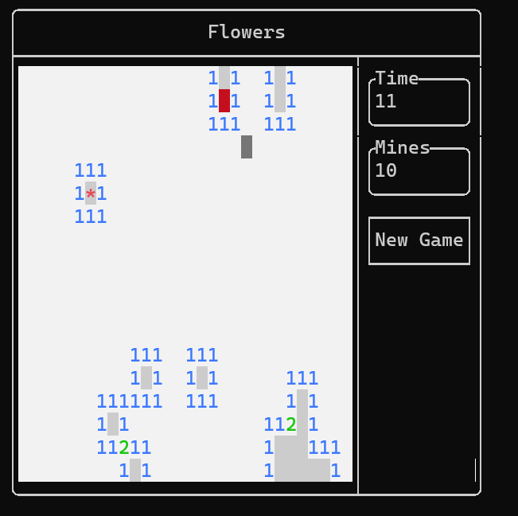
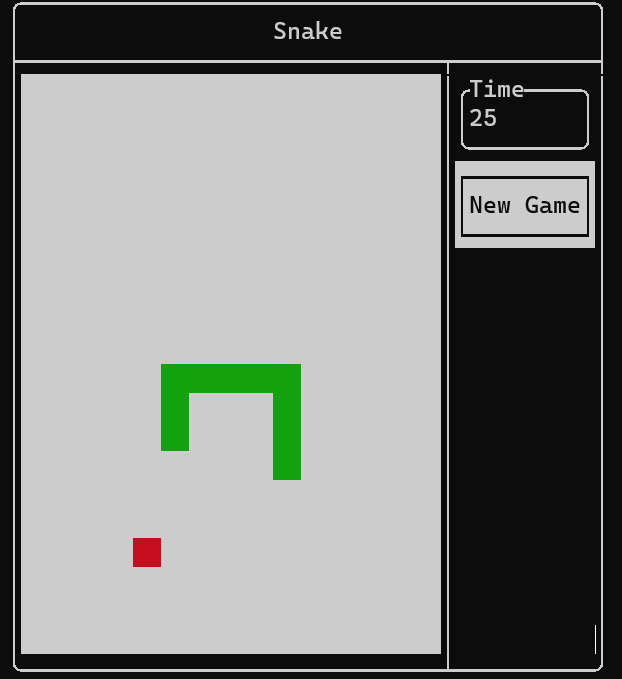
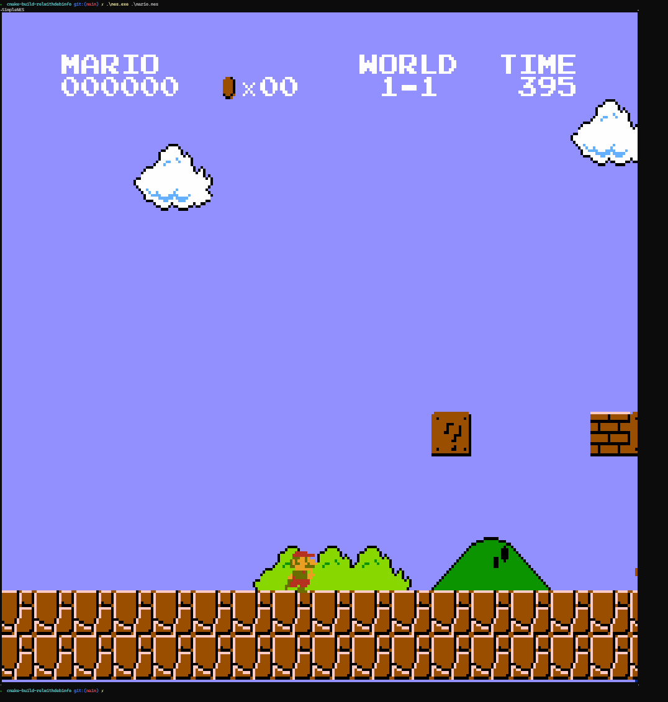
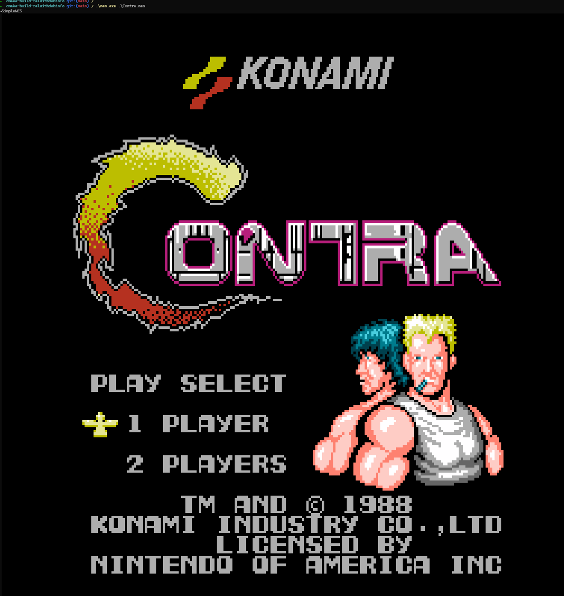
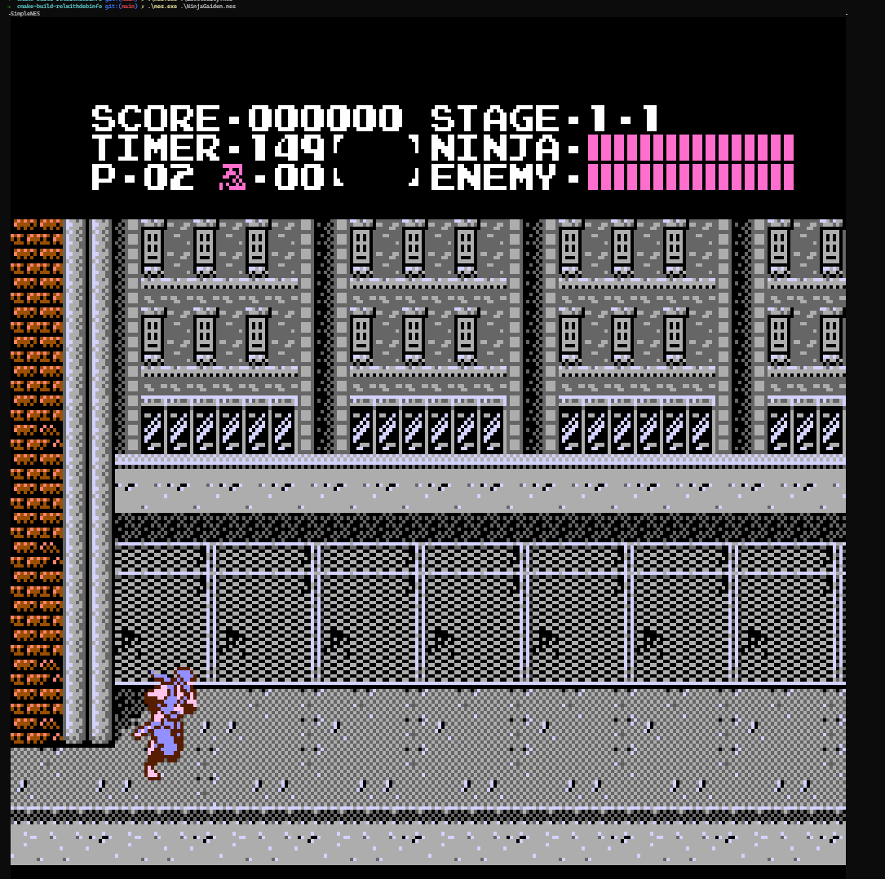

# SimpleGamesTui

Simple Games in wihout GUI

# screenshots

## minesweeper

## snake

## nes simulator

# links

- https://github.com/ArthurSonzogni/FTXUI
- https://github.com/cpp-best-practices/game_jam/blob/main/Jam1_April_2022/consu.md
- [minesweeper_ftxui](https://github.com/ebarlas/minesweeper_ftxui)[[Web demo](https://github.com/ebarlas/minesweeper_ftxui)]
- https://github.com/chximn/CPU
- https://github.com/a-n-t-h-o-n-y/TermOx
- https://github.com/a-n-t-h-o-n-y/NES-Term
- https://github.com/kgabis/agnes
- https://github.com/komrad36/KNES
- https://github.com/johnmph/NESEmu
